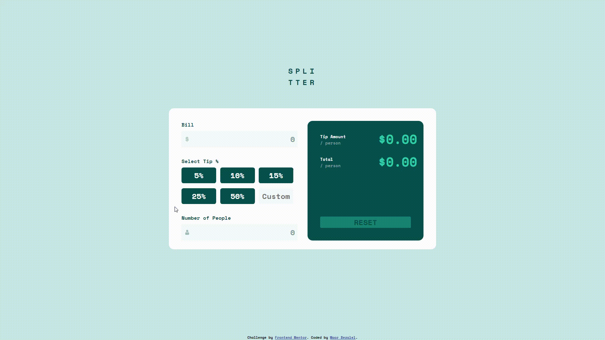

# Frontend Mentor - Tip Calculator App Solution

This project, the "Tip Calculator App", was created as a frontend practice exercise to enhance my skills in HTML, CSS, and JavaScript. 
The idea behind this project came from a challenge provided by Frontend Mentor, a platform that offers design challenges to improve frontend development skills. 
The main objective was to build an interactive app that allows users to calculate tip and total amounts per person based on the bill, tip percentage, and number of people.

## Table of Contents

- [Overview](#overview)
    - [Preview](#preview)
    - [Links](#links)
    - [The Challenge](#the-challenge)
- [Process](#process)
    - [Description](#description)
    - [Key Features](#key-features)
    - [How to Use](#how-to-use)
- [Special Thanks To](#special-thanks-to)
- [License](#license)

## Overview

### Preview

### Links

- **Solution URL**: [https://www.frontendmentor.io/solutions/html5-css3-javascript-css-grid-layout-flexbox-event-listeners-KJonHLGDAL](https://www.frontendmentor.io/solutions/html5-css3-javascript-css-grid-layout-flexbox-event-listeners-KJonHLGDAL)
- **Live Site URL**: [https://maorbezalel.github.io/tip-calculator-app/](https://maorbezalel.github.io/tip-calculator-app/)

### The Challenge

Users should be able to:

- View the optimal layout for the app depending on their device's screen size
- See hover states for all interactive elements on the page
- Calculate the correct tip and total cost of the bill per person

## Process

### Description

The "Tip Calculator App" is a user-friendly web application designed to make splitting bills and calculating tips easy. 
Users can input the bill amount, choose a tip percentage or enter a custom percentage, and specify the number of people. 
The app will automatically provide calculated tip and total amounts per person once all input fields are filled out correctly.

**The project was developed using semantic HTML5, styled with CSS3 for visual aesthetics, and made interactive with JavaScript.**

### Key Features

- **Accurate Tip Calculation**: The app ensures precise tip and total calculations based on user input, with results rounded to two decimal places.
- **Interactive Buttons**: Users can select fixed tip percentages or provide a custom percentage.
- **Input Validation**: The app validates input to avoid errors and provides informative error messages.
- **Responsive Design**: The app is designed to work seamlessly on different devices and screen sizes.

### How to Use

1. Access the live site [here](https://maorbezalel.github.io/tip-calculator-app/).
2. Enter the bill amount, select a tip percentage, and specify the number of people.
3. The app will automatically display the calculated tip amount and total amount per person once all input fields are filled out correctly.

## Special Thanks To

- **Frontend Mentor**: For providing the challenge, design assets, and guidelines for creating this app. 
You can explore their platform [here](https://www.frontendmentor.io/).

## License

This solution is based on a Frontend Mentor challenge and is subject to the terms and conditions of the Frontend Mentor License. 
For more information, refer to the license and guidelines on the Frontend Mentor website. 

[Frontend Mentor License](https://www.frontendmentor.io/license)
